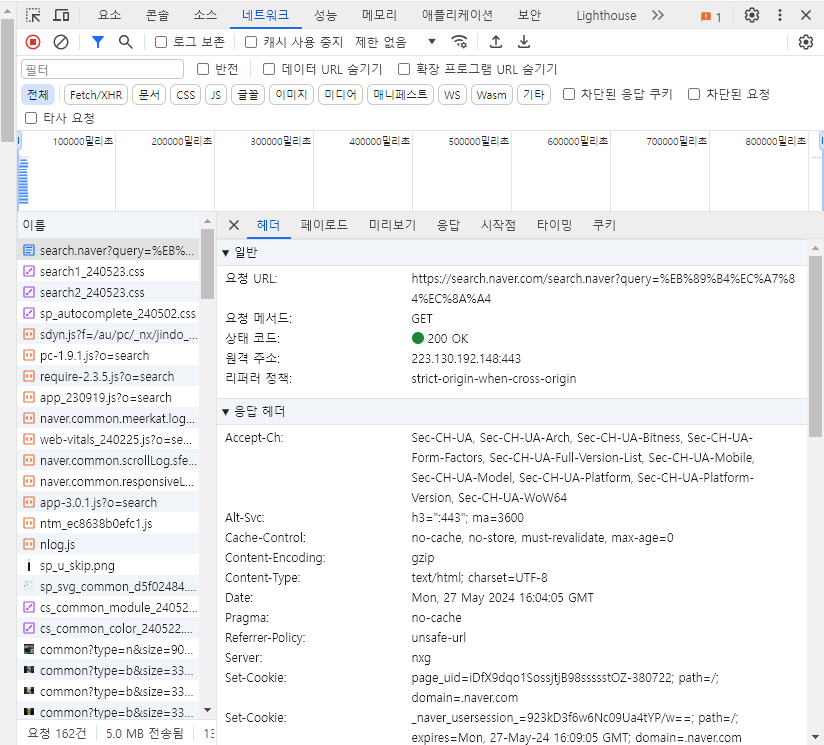

GET은 리소스를 조회하는 메서드이다. query를 통해서 서버에 데이터를 전달한다.
자료를 검색하거나 데이터를 확인할 때 쓰인다.

POST는 요청 데이터를 처리하는 메서드이다. 신규 리소스를 등록하거나, 프로세스 처리에 사용된다. 주로 글을 올리거나 새로운 파일을 생성할 때 사용된다.

PUT는 리소스를 완전히 대체하는 메서드이다. 파일을 완전히 덮을 때 주로 사용한다.

PATCH는 리소스를 부분적으로 대체하는 메서드이다. PUT과 다르게 부분적으로 데이터를 변경한다.
글의 내용이나 데이터를 수정할 때 사용한다.

DELETE는 리소스를 제거하는 메서드이다. 파일이나 데이터를 제거할 때 사용된다.

HTTP 1.1은 하나의 커넥션에서 응답을 기다리지 않고 동시에 여러 개의 명령어를 처리하므로써 정보 처리량을 올리는 파이프라이닝이라는 기술이 있다.
HTTP2는 HTTP1과 달리 STREAM이라는 기술이 도입되어 바이너리 프레이밍 계층을 사용해 요청과 응답의 멀티 플렉싱을 지원해 여러개의 데이터를 섞이지 않게 보낼 수 있게 되었다.
HTTP3에서는 HTTP2와 달리 TCP프로토콜을 UDP로 변경하였다.

